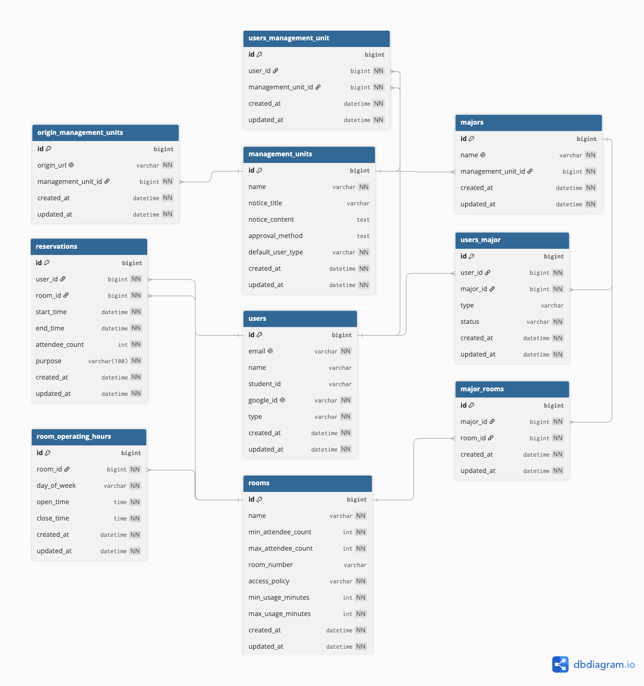

# 성균관대학교 공간 예약 백엔드

  

성균관대학교(SKKU) 공간 예약 서비스를 위한 Spring Boot 백엔드입니다.

## 1. 주요 기능

- Google OAuth2 기반 로그인 및 온보딩
- JWT(HttpOnly Cookie) 기반 인증/인가
- 공간(Room) 생성/수정/삭제/조회
- 예약 생성/조회/취소
- 전공 등록 신청 및 관리자 승인/거절
- 관리 단위(Management Unit) 기반 멀티테넌시 데이터 분리

## 2. 기술 스택

- Java 17
- Spring Boot 3.5.11
- Spring Security, Spring Data JPA
- MySQL
- OpenAPI (springdoc)
- Gradle

## 3. 사전 요구 사항

- Java 17 이상
- MySQL 8.0 이상
- Docker (선택)

## 4. 빠른 시작

### 4.1 환경 변수

아래 값은 최소 실행 기준입니다.

| 변수명                 | 설명                                                           |
| ---------------------- | -------------------------------------------------------------- |
| `DB_URL`               | MySQL JDBC URL (예: `jdbc:mysql://localhost:3306/reservation`) |
| `DB_USERNAME`          | DB 사용자명                                                    |
| `DB_PASSWORD`          | DB 비밀번호                                                    |
| `JWT_SECRET`           | JWT 서명 키                                                    |
| `GOOGLE_CLIENT_ID`     | Google OAuth Client ID                                         |
| `GOOGLE_CLIENT_SECRET` | Google OAuth Client Secret                                     |
| `GOOGLE_CALLBACK_URI`  | OAuth 콜백 URI                                                 |

`dev` 프로파일에서 Swagger Basic Auth를 사용할 경우 아래 변수도 필요합니다.

| 변수명             | 설명                        |
| ------------------ | --------------------------- |
| `SWAGGER_ID`       | Swagger Basic Auth ID       |
| `SWAGGER_PASSWORD` | Swagger Basic Auth 비밀번호 |

### 4.2 로컬 실행

```bash
./gradlew clean build
./gradlew bootRun --args='--spring.profiles.active=local'
```

기본 포트는 `8000`입니다.

### 4.3 Docker 실행 (선택)

```bash
docker build -t room-reservation-backend .
docker run -p 8000:8000 \
  -e DB_URL=jdbc:mysql://host.docker.internal:3306/reservation \
  -e DB_USERNAME=... \
  -e DB_PASSWORD=... \
  -e JWT_SECRET=... \
  -e GOOGLE_CLIENT_ID=... \
  -e GOOGLE_CLIENT_SECRET=... \
  -e GOOGLE_CALLBACK_URI=... \
  room-reservation-backend
```

## 5. 멀티테넌시 구현 방식

이 프로젝트는 **Shared DB + Shared Schema** 구조에서 `managementUnit`을 테넌트 경계로 사용합니다.

### 5.1 테넌트 식별

- 공개 조회 API는 요청의 `Origin`을 기준으로 테넌트를 식별합니다.
- `@ManagementUnitId` 파라미터에 대해 `ManagementUnitIdArgumentResolver`가 `Origin -> managementUnitId`를 주입합니다.
- 매핑은 `origin_management_units` 테이블을 조회합니다.

### 5.2 권한 컨텍스트

- 로그인 시 `users_management_unit` 기준으로 사용자 관리 권한 테넌트 목록(`managingUnitIds`)을 조회합니다.
- 해당 목록을 JWT claim에 담아 요청마다 `UserPrincipal`로 복원합니다.
- `@AdminApi`는 `managingUnitIds`가 있는 사용자만 접근 가능합니다.

### 5.3 데이터 경계 강제

- 관리자 조회/수정 API는 `managingUnitIds` 기반 쿼리 필터를 적용합니다.
- `Room`, `Major`, `User`, `Reservation` 관련 서비스에서 권한이 없는 타 테넌트 데이터 접근 시 `ACCESS_DENIED`를 발생시킵니다.

## 6. API 문서

- Swagger UI: `/swagger-ui/index.html`
- OpenAPI JSON: `/v3/api-docs`

프로파일별 정책:

- `local`: Swagger 공개
- `dev`: Swagger Basic Auth 적용 (`SWAGGER_ID`, `SWAGGER_PASSWORD`)

## 7. ERD



## 8. 프로젝트 구조

```text
src/main/java/edu/skku/scg/reservation
├── domain
│   ├── auth
│   ├── organization
│   ├── reservation
│   ├── room
│   └── user
└── global
    ├── annotation
    ├── config
    ├── exception
    └── resolver
```

## 9. 환경 프로파일

- `src/main/resources/application.yml`
- `src/main/resources/application-local.yml`
- `src/main/resources/application-dev.yml`
- `src/main/resources/application-prod.yml`
